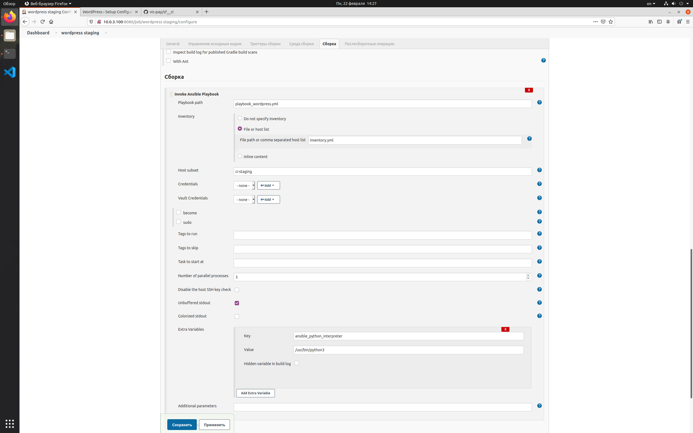
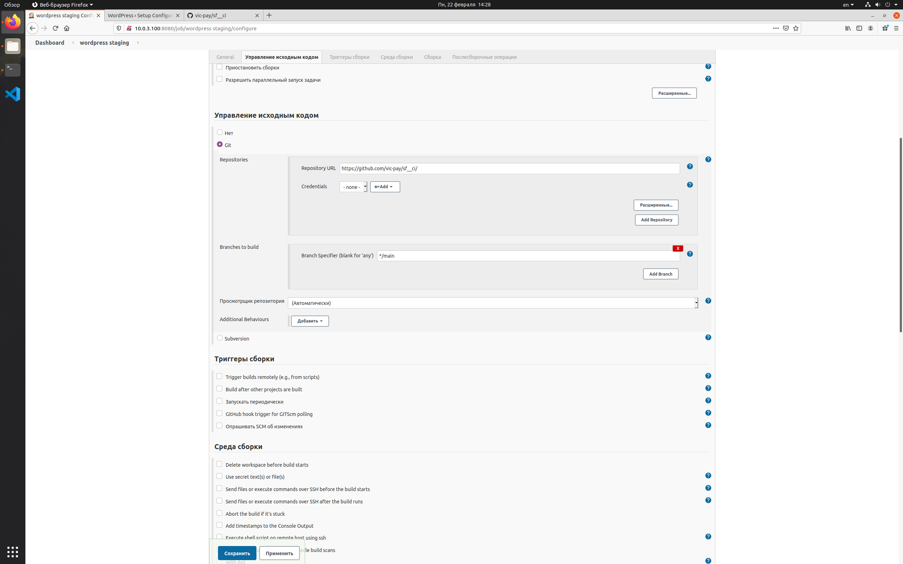
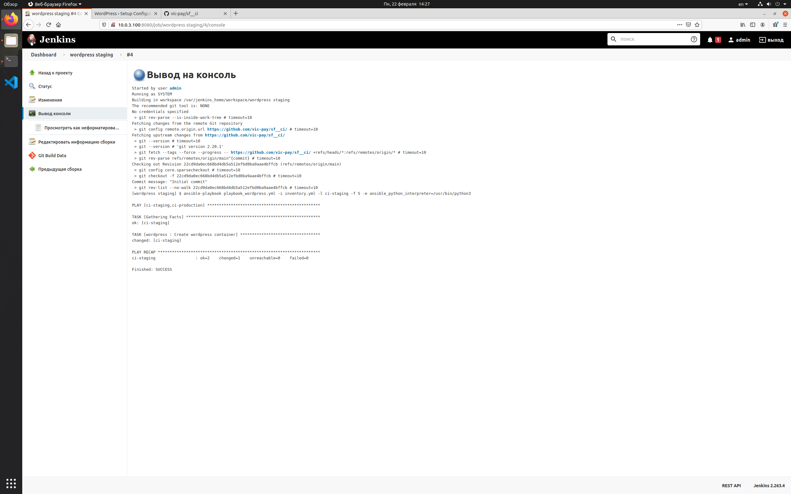
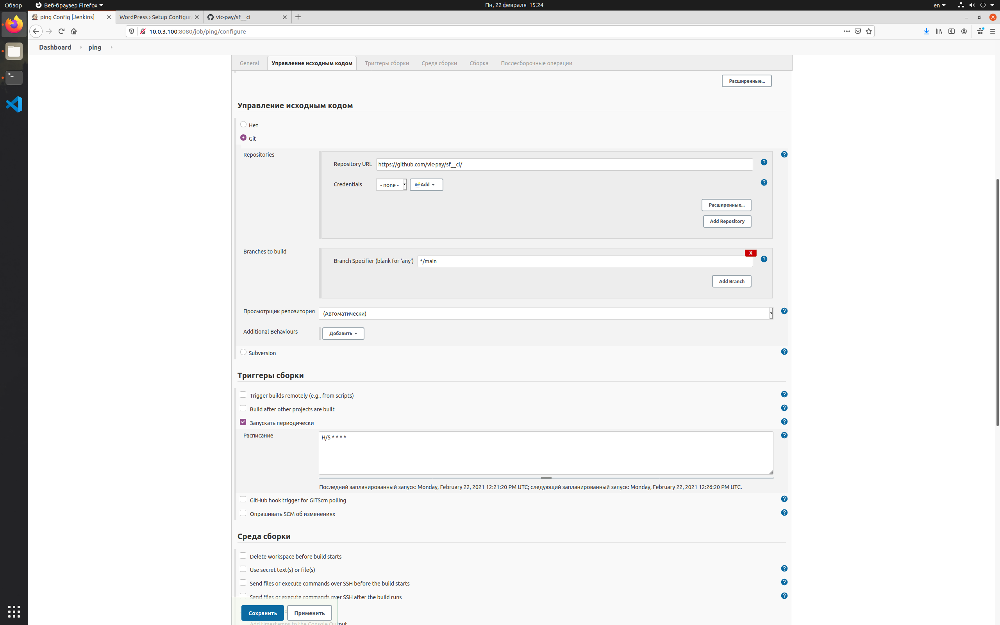

# Практикум. Модуль 21. Continuous Integration

## Задания по созданию окружения

### Задание 21.1
Разверните сервер с Jenkins CI и две дополнительные машины, которые будут эмулировать production и stating окружения.

### Задание 21.2
Используйте Ansible для создания деплоймента: все три машины должны разворачиваться на основе ansible playbook.

### Задание 21.3
На все машины установите Docker. На машине с Jenkins настройте Docker, чтобы контейнеры могли запускаться от имени пользователя Jenkins.

### Задание 21.4
Машина Jenkins CI должна уметь «ходить» по ssh от имени Jenkins на машины production и staging. Идеально, если добавление ключей к целевым машинам настроено уже в ansible playbook.

### Решение
Для выполнения данных задач создан anslible playbook, который:
- на локальной машине установит и настроит LXD;
- создаст три контейнера ci-jenkins, ci-staging, ci-production, эмулирующие инфраструктуру;
- установит docker во все контейнеры;
- сгенерирует ssh-ключ на ci-jenkins;
- установит jenkins в docker контейнер на ci-jenkins;
- создаст учетные записи jenkins и импортирует ssh-ключ на ci-staging, ci-production.

Внимание! данный playbook не добавляет на ci-jenkins ключи в known_hosts по причинам безопасности. 

Для использования выполните следующие действия:
1. скопировать данный репозиторий;
2. перейти в папку с репозиторием;
3. перейти в папку other;
4. выполнить команду ./run_deploy.sh
5. ввести пароль sudo.

## Задания по настройке Jenkins

### Задание 21.5, пункт 1
Настроить в Jenkins джоб (job): Запуск контейнера с WordPress на staging-машине.
Настройки и вывод приведены на скриншотах.

ping

